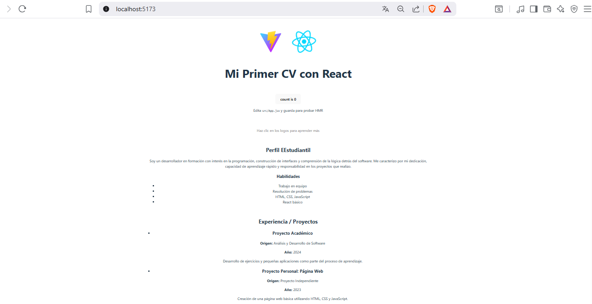

# Mi Primer CV con React

Este proyecto es una hoja de vida digital creada con **React** y el entorno de desarrollo **Vite**.  
Hace parte de una actividad formativa donde se implementan componentes, props, estructura de carpetas y control de versiones con Git y GitHub.

---

## Características del proyecto

- Componente **Perfil**
- Componente **Experiencia** (adaptado para mostrar “Sin experiencia laboral”)
- Componente **Educación**
- Estructura de carpetas organizada
- Proyecto inicializado con Vite

---

## Captura de pantalla

## 

## Cómo ejecutar este proyecto

Cómo ejecutar este proyecto

1. Clona este repositorio:

git clone https://github.com/Sebastian-s-Organization/Project-React-Angular.git

Entra a la carpeta del proyecto:

cd Project-React-Angular/mi-proyecto-react

Instala las dependencias:

npm install

Ejecuta el proyecto:

npm run dev

Abre el navegador y ve a la URL indicada por Vite, normalmente:

http://localhost:5173/

# Actividad 6

“Actividad: Crear un nuevo componente llamado StackTecnologias en React, importarlo en App.jsx e integrarlo como una sección adicional del CV, mostrando las tecnologías que manejo.”

# Actividad 7 — Actualización

✔️ Cambios realizados en esta actividad

En la Actividad 7 se realizaron los siguientes pasos:

Se creó el componente CabeceraCV y se integró en App.jsx.

Se agregaron props dinámicas para mostrar nombre, cargo, ciudad y contacto.

Se validó el funcionamiento del componente desde App.jsx.

Se creó el componente Perfil, ahora recibiendo información mediante props.

Se reorganizó la estructura del componente para cumplir con las instrucciones de la guía.

Se añadieron evidencias y commits siguiendo las convenciones solicitadas.
